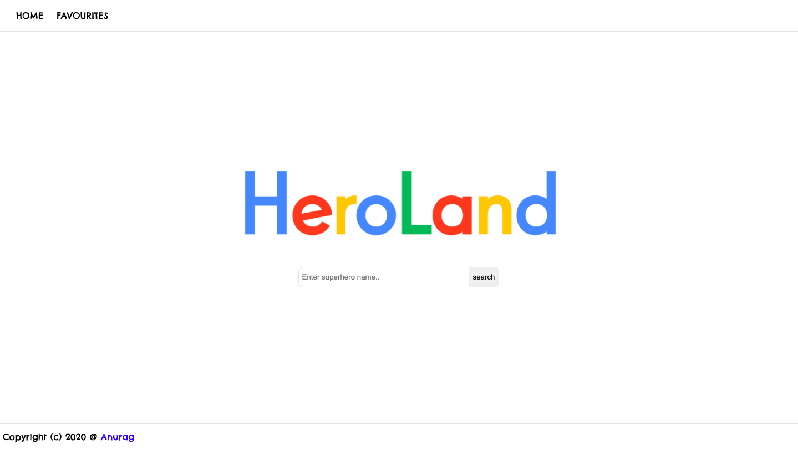
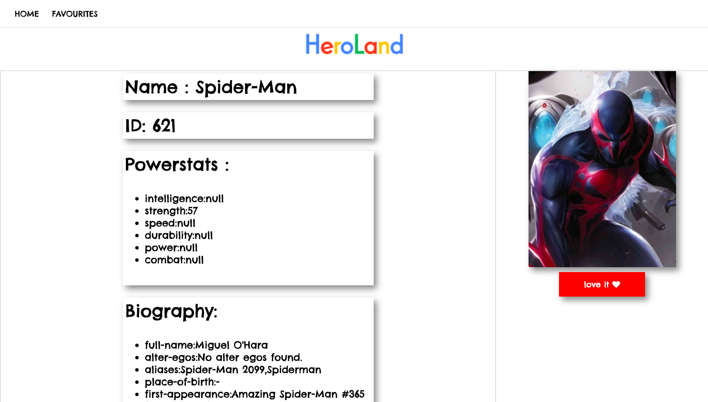
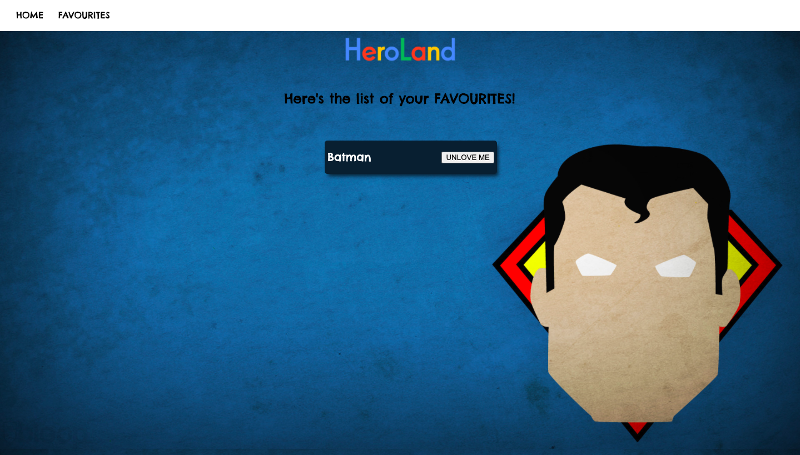

# heroLand
Bored? Want to learn something about superheros? Well, you name it, we have it! Welcome to heroLand find almost infinite superheros and there details here!
URL : https://anuragzv1.github.io/heroLand/

Just Go to the above URL type any superhero name and click one superhero from the suggested results and voila a ton of information awaits you!

### API USED 
Thanks to the developer of the API for providing such a huge database of superheros

### Functionalities
1.Super Responsive. 
2.Quick Auto Suggestions. 
3.Favourite hero list (Persistant). 
4.Large number of Superheroes. 
5.Clean UI and Intelligent Redirects. 

## Homepage
The Home page is as intutive as it gets , the design is inspired from Google's homepage , as you search it'll suggest you related terms

## Superhero profile
Page Contains various information about the Superhero like the Powerstats , Biograpgy , name , Image etc

## Favourite
Contains a list of all your favourite superheros! the list is persistent, so dont worry ,even if you close the browser, it'll still be there!

